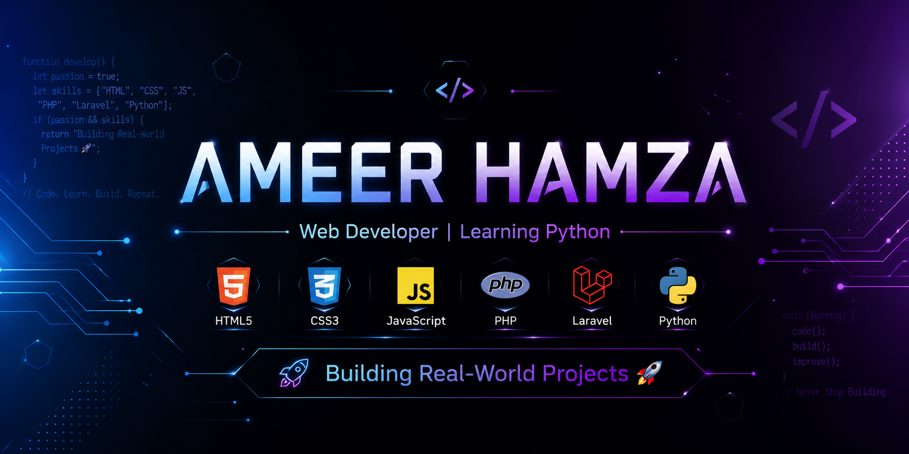

  

# 💫 Hi 👋, I'm  Ameer Hamza
A passionate Cloud Engineer || DevOps Engineer 

# 💻 Tech Stack:
                     

## 🌐 Socials

 <!-- Snake Game Repo View -->

  

# 📊 GitHub Stats:
 
 

### ✍️ Random Dev Quote

<!-- Proudly created with GPRM ( https://gprm.itsvg.in ) -->
